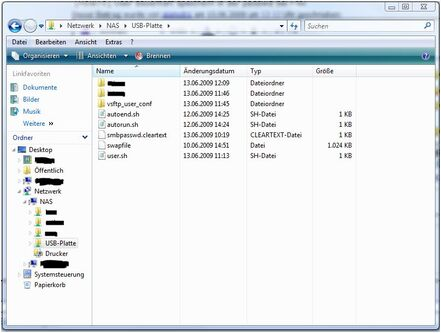
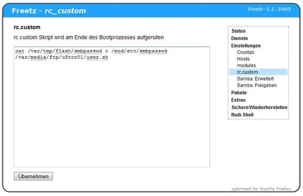

# Benutzer dauerhaft in der passwd speichern

### Beschreibung (Freetz-1.2.x)

Benutzer können mit dem Busybox-Applet
[adduser](http://busybox.net/downloads/BusyBox.html)
angelegt werden. Beispielhaft werden wir jetzt einen Benutzer
"freetzuser" erstellen. Er wird der Gruppe *users* zugeordnet. Sein
Heimverzeichnis soll */var/media/ftp sein*. Falls es dem Benutzer
möglich sein soll sich auf der Box via telnet/ssh anzumelden, muss ihm
eine Login-Shell zugewiesen werden. Dies geschieht durch den Parameter
`-s /bin/sh`. Der Parameter -g (GECOS field) ist eine Beschreibung des
Benutzers.

 Dieses
Feld darf nicht auf *box user* oder *ftp user* gesetzt werden, da der
Benutzer sonst beim Neustart verloren geht.

```
	adduser freetzuser -G users -h "/var/media/ftp" -g "freetzuser" [-s /bin/sh]
```

Anschließend kann ein Password für den Benutzer gesetzt werden:

```
	root@fritz:/var/mod/root# adduser freetzuser -G users -h "/var/media/ftp" -g "freetzuser"
	Changing password for freetzuser
	New password:
	Retype password:
	Password for freetzuser changed by root
```

Dieses Verfahren ist für jeden weiteren Benutzer zu wiederholen. Nachdem
die gewünschten Benutzer angelegt wurden sind die Änderungen noch
rebootfest abzuspeichern. Dies geschieht durch die folgenden Befehle:

```
	modusers save
	modsave flash
```

Die Benutzer können wie folgt überprüft werden:

```
	root@fritz:/var/mod/root# cat /etc/passwd
	root:x:0:0:root:/mod/root:/bin/sh
	nobody:x:100:1000:nobody:/home/nobody:/bin/false
	ftpuser:any:1001:0:ftp user:/var/media/ftp:/bin/sh
	freetzuser:x:1002:100:freetzuser:/var/media/ftp:/bin/sh
```

### Beschreibung (Freetz-1.1.x)

Erzeugen einer User.sh auf der USB-Platte und diese beim Systemstart per
rc.custom (/var/media/ftp/uStor01/user.sh) einlesen lassen.

### Originalbeiträge zum HowTo

1.) [Original Post aus dem IPPF](http://www.ip-phone-forum.de/showpost.php?p=1248433&postcount=47)\
2.) [Original Post aus dem IPPF](http://www.ip-phone-forum.de/showpost.php?p=1246909&postcount=11)\

### Vorgehen

1.) Man speichert den Inhalt des Nachfolgenden Textes als User.sh auf
seinen PC\

```
	cat > /var/tmp/passwd << 'EOF'
	root:x:0:0:root:/mod/root:/bin/sh
	ftpuser:any:1000:0:ftp user:/var/media/ftp:/bin/sh
	ftp:x:1:1:FTP account:/home/ftp:/bin/sh
	User1:x:1001:1001:Linux User,,,:/var/media/ftp/uStor01/User1:/bin/sh
	User2:x:1002:1002:Linux User,,,:/var/media/ftp/uStor01/User2:/bin/sh
	User3:x:1003:1003:Linux User,,,:/var/media/ftp/uStor01/User3:/bin/sh
	EOF
	chmod 644 /var/tmp/passwd
```

2.) Man ruft die passwd seiner Box im Rudi-Shell-Menu auf (cat /var/tmp/passwd)\
    [](../../screenshots/000-RMD_user-rudi.jpg)

3.) man öffnet die User.sh und ersetzt den user1 bis user3 durch seine Einträge aus der Rudi-Shell\
    (einfach copy & paste).

4.) Datei speichern und auf den USB-Datenträger kopieren.\
    [](../../screenshots/000-RMD_user-usb.jpg)

5.) Folgenden Eintrag in der rc.custom erzeugen (Pfad und Dateiname entpsrechend anpassen):\
```
	/var/media/ftp/uStor01/user.sh
```
[](../../screenshots/000-RMD_user-rc_custom.jpg)

6.) Eintrag mit übernehmen sichern und FritzBox neu starten.\
    Wenn Ihr alles Richtig gemacht habt und ich in diesem HowTo nichts vergessen habe sollten Eure\
    User nun in der passwd erhalten bleiben.

### Alternative

Man kann die Einträge aus 1.) auch direkt in die rc.custom schreiben.
Die Benutzer und Passwörter müssen natürlich auch in diesem Fall
angepasst werden.

[](../../screenshots/000-RMD_user-editor.jpg)\

