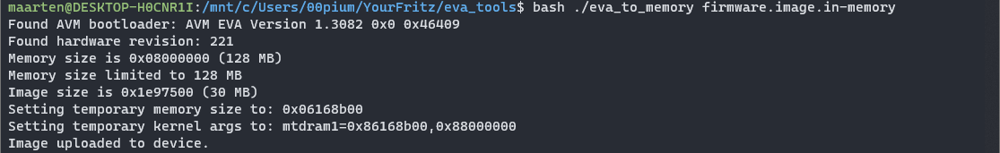

# My Freetz-NG documentation
Because Installing Freetz-NG on my FRITZ!Box 7560 was such a pain in the ass, I wanted to document everything here for later.

**Step 1**  
I first cloned the repo. I had some trouble building it on Fedora 39, so I created a Debian `chroot` instance. I basically opened Debian from Fedora and after some tinkering this went well.  
I proceeded to build the image using `make menuconfig`, and then `make`.

Now this is where the pain started. The `tools/push-firmware` didn't detect my FRITZ!Box in time.
This is were the deep deep, sink hole started were I had to find an alternative way of flashing it. This is how I did it:

**Step 2**  
After i was done building the image on Debian, I moved it to my Windows disk. From there I used [EVA tools](https://github.com/PeterPawn/YourFritz/tree/main/eva_tools) to convert the `.image` file to an `.image.in-memory` file.
I did this in WSL, in the root user with the command

```console
$ ./image2ram < path/to/images/latest.image > firmware.image.in-memory
```
This converted the image in to an image-in-memory file, or something.

After that, it was easy. I could easily flash the special image using the EVA tools as well:


```console
$ bash ./eva_to_memory firmware.image.in-memory
```
And it worked!  
I have put a backup/snapshot of the Freetz-NG repo and the EVA tools in this repo, incase something bad happens in the future.


I think everything could've been done in Linux but the only thing holding it back is that the network connection establishes too slow, so the moment the FRITZ!Box can be flashed ("ftp mode") is missed.	
